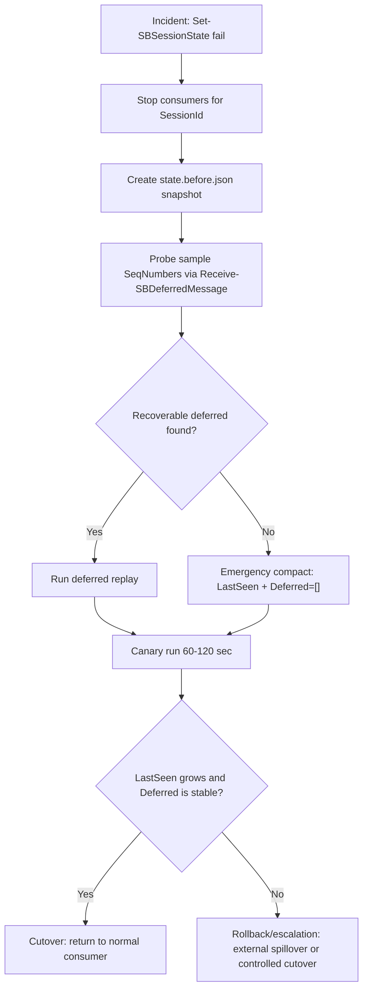
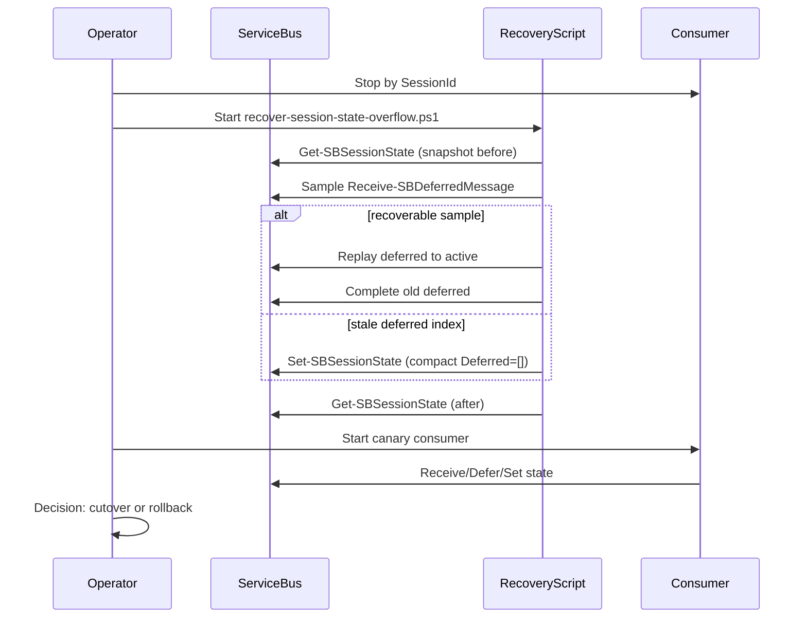

# Session State Overflow Recovery Runbook (EN)

This process is used when the consumer fails while persisting session state (typically near the 256 KiB limit in Standard tier), and you need to restore processing with minimal data-loss risk.

## When to run
- `Set-SBSessionState` fails (`ServiceTimeout`, `owner is being closed`, etc.)
- Session state is close to limit (`Utf8Bytes` around 240k+)
- State contains a large `Deferred[]`

## Preconditions
- Stop all consumer processes for the target `SessionId`
- Ensure module is built (`dotnet build`)
- Prepare connection string

## Operational flow (phase-gated)
1. **Freeze and snapshot**
- Save state to `state.<sid>.before.json`
- Record `LastSeen`, `DeferredCount`, and UTF-8 state size

2. **Deferred recoverability check**
- Take a `SeqNumber` sample from snapshot (for example, 100-200 entries spread across list)
- Verify with `Receive-SBDeferredMessage -ChunkSize 1`
- If `ok > 0`, proceed with full replay
- If `ok = 0` and all responses are `MessageNotFound`, treat `Deferred[]` in state as stale index

3. **Emergency compact**
- Set state to `{ LastSeen*, Deferred=[] }`
- Goal: immediately remove state-overflow risk and restore ability to persist state

4. **Deferred replay (if recoverable)**
- Run `recover-session-state-overflow.ps1`
- Process chunk by chunk, immediately `Send-SBMessage` + `Set-SBMessage -Complete`
- Count `MessageNotFound` as `NotFoundCount` and continue

5. **Canary consumer run**
- Start consumer for 60-120 seconds
- Check deltas for `LastSeen` and `DeferredCount`

6. **Cutover/rollback decision**
- `Cutover`: `LastSeen` increases and `DeferredCount` does not grow explosively
- `Rollback`: `LastSeen` does not increase and `DeferredCount` grows rapidly (overflow risk returns)

## Recovery process diagrams

### 1) Main flow (phase-gated)


### 2) Operation sequence


## Recovery command
```pwsh
$cs = "Endpoint=sb://localhost;SharedAccessKeyName=RootManageSharedAccessKey;SharedAccessKey=LocalEmulatorKey123!;UseDevelopmentEmulator=true;"
$sid = "stress-session-..."

pwsh ./scripts/stress/recover-session-state-overflow.ps1 `
  -ConnStr $cs `
  -SessionId $sid `
  -Topic "NO_SESSION" `
  -Subscription "STATE_SUB" `
  -SnapDir "./out/recovery-runs"
```

## Success criteria
- Recovery script finishes without unhandled exceptions
- `summary.json` is produced with meaningful `RecoveredCount/NotFoundCount`
- `Get-SBSessionState` reports compact state (`Deferred=[]` or controlled small state)
- Canary run does not drive state back toward limit

## Rollback
- Use pre-snapshot (`state.<sid>.before.json`)
- Restore state manually:
```pwsh
$ctx = New-SBSessionContext -Topic "NO_SESSION" -Subscription "STATE_SUB" -SessionId $sid -ServiceBusConnectionString $cs
Set-SBSessionState -SessionContext $ctx -State (Get-Content ./state.<sid>.before.json -Raw)
Close-SBSessionContext -Context $ctx
```

## Field validation on emulator (Feb 12, 2026)
- Before recovery: `DeferredCount=8098`, `Utf8Bytes=261668`, `Set-SBSessionState` failed (`ServiceTimeout`)
- Deferred sample from snapshot: `ok=0`, `miss=120` (`MessageNotFound`) -> stale deferred index
- After emergency compact: state became `LastSeen=1`, `Deferred=0`
- Canary after compact: `Deferred` grew again (`0 -> 1461` in ~2 minutes), `LastSeen` unchanged
- Conclusion: state reset removes immediate state-write failure but does not guarantee order-progress recovery

## Limitations and notes
- If another consumer runs on the same `SessionId`, `SessionCannotBeLocked` may occur
- At large volumes, recovery with single-message fallback may take tens of minutes
- If `Deferred[]` in state is stale, zero `ok` in sample usually means replay from state is ineffective
- Long-term fix requires state-size guardrail + external deferred spillover (or redesign of deferred tracking)
