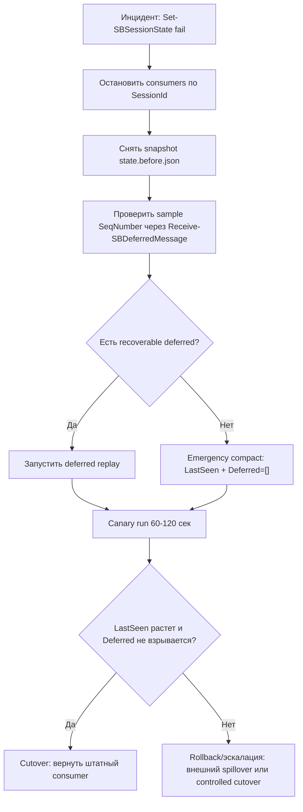
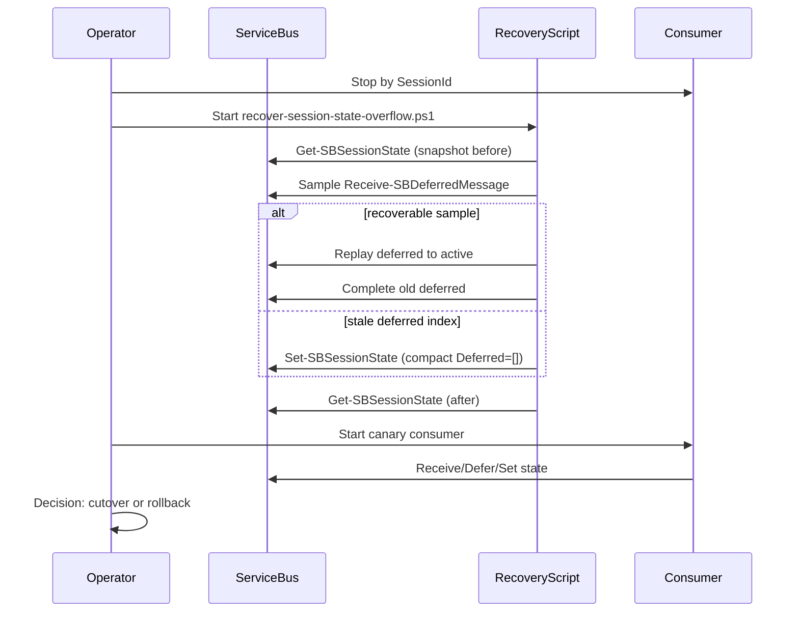
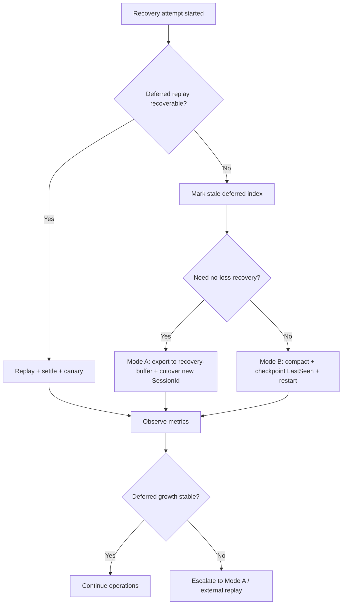

# Session State Overflow Recovery Runbook (RU)

Этот процесс применяется, когда consumer падает на сохранении session state (обычно около лимита 256 KiB в Standard), и нужно восстановить обработку с минимальным риском потери данных.

## Когда запускать
- Ошибка на `Set-SBSessionState` (`ServiceTimeout`, `owner is being closed`, и т.п.)
- Session state близок к лимиту (`Utf8Bytes` примерно 240k+)
- В state большой `Deferred[]`

## Предусловия
- Остановить все consumer-процессы для конкретного `SessionId`
- Убедиться, что модуль собран (`dotnet build`)
- Подготовить connection string

## Операционный процесс (с phase-gate)
1. **Freeze и snapshot**
- Сохранить state в `state.<sid>.before.json`
- Зафиксировать: `LastSeen`, `DeferredCount`, размер state в UTF-8 байтах

2. **Проверка recoverability deferred**
- Взять выборку `SeqNumber` из snapshot (например, 100-200 равномерно по списку)
- Проверить через `Receive-SBDeferredMessage -ChunkSize 1`
- Если `ok > 0`, запускать полный replay
- Если `ok = 0` и везде `MessageNotFound`, считать `Deferred[]` в state устаревшим (stale index)

3. **Emergency compact**
- Установить state как `{ LastSeen*, Deferred=[] }`
- Цель: немедленно убрать риск переполнения state и вернуть возможность писать state

4. **Replay deferred (если recoverable)**
- Запустить `recover-session-state-overflow.ps1`
- Обрабатывать chunk, сразу `Send-SBMessage` + `Set-SBMessage -Complete`
- `MessageNotFound` учитывать как `NotFoundCount`, но не падать

5. **Canary consumer run**
- Запустить consumer на 60-120 секунд
- Проверить дельту `LastSeen` и `DeferredCount`

6. **Решение cutover/rollback**
- `Cutover`: `LastSeen` растет, `DeferredCount` не растет взрывно
- `Rollback`: `LastSeen` не растет, `DeferredCount` быстро растет (риск повторного overflow)

## Изменение процесса для ручного восстановления (Recovery v2)
Цель `v2`: сделать ручное восстановление повторяемым и предсказуемым даже когда `Deferred[]` в state stale.

### Режим A (рекомендуется): без потерь
1. `Freeze`: остановить producer/consumer по `SessionId`.
2. Снять `state.before.json` и сохранить run артефакты.
3. Выполнить `Emergency compact` (`Deferred=[]`) только для снятия аварийности state.
4. Выгрузить активные сообщения сессии в внешний recovery-buffer (queue/topic/storage), при выгрузке завершать оригиналы.
5. Переключить живой трафик на новый `SessionId` (cutover), чтобы прод не стоял.
6. Отдельно переиграть recovery-buffer через упорядочивающий pipeline с внешним durable state.

### Режим B: быстрый запуск (допустима контролируемая потеря)
1. `Emergency compact`.
2. Установить согласованный `LastSeen` (операционный checkpoint).
3. Запустить consumer и мониторить темп роста `Deferred`.
4. Если `Deferred` снова растет взрывно, вернуться к Режиму A.

### Что нужно добавить в процесс/инструменты
- Отдельный `export/drain` скрипт: active session messages -> recovery-buffer (copy+complete).
- Явный `cutover` scriptbook: новый `SessionId`, freeze окна, rollback-критерии.
- Внешний durable storage для deferred index/replay (чтобы не упираться в 256 KiB session state).

## Диаграммы процесса восстановления

### 1) Основной flow (phase-gate)


### 2) Последовательность операций


### 3) Decision flow для Recovery v2


## Команда запуска recovery
```pwsh
$cs = "Endpoint=sb://localhost;SharedAccessKeyName=RootManageSharedAccessKey;SharedAccessKey=LocalEmulatorKey123!;UseDevelopmentEmulator=true;"
$sid = "stress-session-..."

pwsh ./scripts/stress/recover-session-state-overflow.ps1 `
  -ConnStr $cs `
  -SessionId $sid `
  -Topic "NO_SESSION" `
  -Subscription "STATE_SUB" `
  -SnapDir "./out/recovery-runs"
```

## Критерии успеха
- Recovery-скрипт завершился без исключений
- Получен `summary.json` с понятным `RecoveredCount/NotFoundCount`
- `Get-SBSessionState` показывает компактный state (`Deferred=[]` или контролируемо малый)
- Canary-run не возвращает процесс к росту state до лимита

## Rollback
- Использовать pre-snapshot (`state.<sid>.before.json`)
- Восстановить state вручную:
```pwsh
$ctx = New-SBSessionContext -Topic "NO_SESSION" -Subscription "STATE_SUB" -SessionId $sid -ServiceBusConnectionString $cs
Set-SBSessionState -SessionContext $ctx -State (Get-Content ./state.<sid>.before.json -Raw)
Close-SBSessionContext -Context $ctx
```

## Полевая проверка на эмуляторе (2026-02-12)
- Перед recovery: `DeferredCount=8098`, `Utf8Bytes=261668`, ошибка на `Set-SBSessionState` (`ServiceTimeout`)
- Выборка deferred из snapshot: `ok=0`, `miss=120` (`MessageNotFound`) -> stale deferred index
- После emergency compact: state стал `LastSeen=1`, `Deferred=0`
- Canary после compact: `Deferred` снова растет (`0 -> 1461` за ~2 минуты), `LastSeen` не меняется
- Вывод: reset state сам по себе снимает аварийность записи state, но не гарантирует восстановление прогресса по order

## Ограничения и замечания
- Если параллельно работает другой consumer на том же `SessionId`, возможен `SessionCannotBeLocked`
- На больших объемах recovery (с singles fallback) может занимать десятки минут
- Если `Deferred[]` в state stale, полное отсутствие `ok` в sample обычно означает, что replay из state бесполезен
- Для долгосрочного решения нужен guardrail по размеру state + spillover во внешнее хранилище (или изменение алгоритма хранения deferred)
