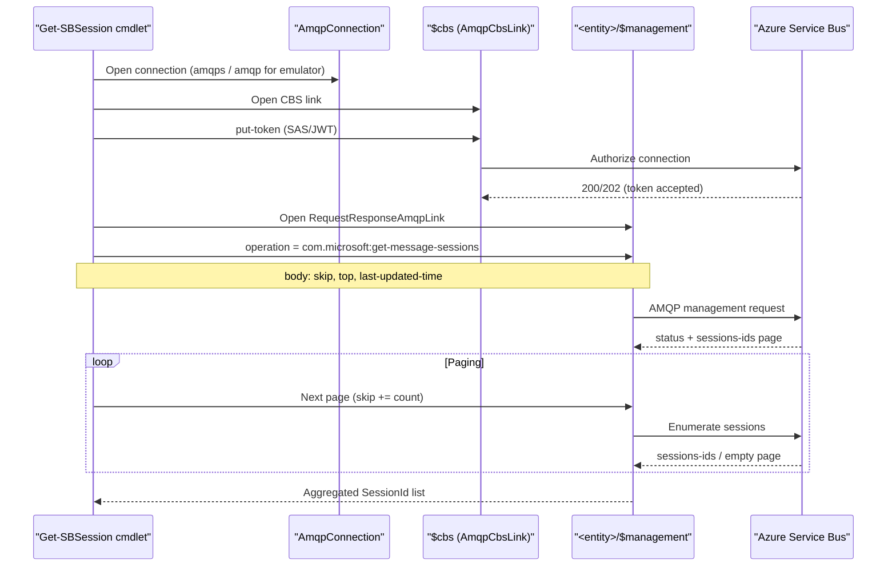

# `Get-SBSession`: Implementation Details

This document explains how `Get-SBSession` is implemented in `SBPowerShell`: why a low-level implementation is needed, how it works over AMQP management, what the modes mean, and what differences exist between Azure Service Bus and the local Service Bus Emulator.

## Why a low-level implementation was needed

`Azure.Messaging.ServiceBus` (Track2 SDK) does not expose a public API like:

- `GetMessageSessions()`
- `ListSessions()`

However, the legacy SDK (`WindowsAzure.ServiceBus` / Track1) did support session enumeration through `QueueClient.GetMessageSessions()` and `SubscriptionClient.GetMessageSessions()`.

Conclusion: the operation exists on the Service Bus side, but Track2 does not expose it. `Get-SBSession` therefore uses a low-level AMQP management call.

## What the cmdlet does

The cmdlet:

- accepts either a queue or a topic/subscription
- opens an AMQP connection
- performs CBS authorization (`$cbs`)
- opens a management link on `<entity>/$management`
- invokes AMQP operation `com.microsoft:get-message-sessions`
- reads paged `sessions-ids`
- returns `SBSessionInfo` (`SessionId`, `EntityPath`, `Queue/Topic/Subscription`)

## Main files

- `src/SBPowerShell/Cmdlets/GetSBSessionCommand.cs` - PowerShell cmdlet and parameter handling
- `src/SBPowerShell/Amqp/ServiceBusSessionEnumerator.cs` - low-level AMQP/CBS/management implementation
- `src/SBPowerShell/Models/SBSessionInfo.cs` - output model

## Cmdlet parameters and semantics

### Entity selection

Two parameter sets are supported:

- Queue:
  - `-Queue`
- Topic/subscription:
  - `-Topic`
  - `-Subscription`

### Enumeration modes

- `default` (without `-ActiveOnly` and without `-LastUpdatedSince`)
  - sends `last-updated-time = DateTime.MaxValue` (UTC sentinel)
  - this matches the low-level behavior of parameterless `GetMessageSessions()` in the legacy Track1 SDK

- `-ActiveOnly`
  - kept for legacy compatibility
  - currently maps to the same `DateTime.MaxValue` sentinel on the wire
  - this is intentional because Track1 effectively did the same (despite XML docs wording)

- `-LastUpdatedSince <DateTime>`
  - sends the provided `last-updated-time`
  - returns sessions whose `session state` was updated after the specified time

### Timeout

- `-OperationTimeoutSec`
  - controls the overall cmdlet operation timeout (AMQP connect/CBS/management request)

## Wire-level protocol (what is sent)

### AMQP management operation

The implementation uses:

- `com.microsoft:get-message-sessions`

This is a Service Bus management operation supported by the service, but not exposed as a public Track2 SDK method.

### Request body (AMQP map)

The request body is an `AMQP map` (`AmqpMap`), not a regular .NET `Dictionary`.

Fields:

- `skip`
- `top`
- `last-updated-time` (required for the current implementation, including `DateTime.MaxValue` sentinel)

### Response body

Expected fields:

- `skip`
- `sessions-ids`

Status fields are read from `application-properties`:

- `statusCode` / `statusDescription`
- fallback: `status-code` / `status-description`

## Why CBS is required

Before invoking the management operation, Service Bus requires authorization.

Sequence:

1. Open AMQP connection
2. Open `AmqpCbsLink` (`$cbs`)
3. Send `put-token` (SAS token)
4. Open management link on `<entity>/$management`
5. Call `com.microsoft:get-message-sessions`

Without CBS authorization, the service typically returns `401 Unauthorized`.

### Sequence diagram

## SAS/CBS implementation details (important)

### 1) SAS signature generation for Azure Service Bus

For SAS-based connection strings (`SharedAccessKeyName/SharedAccessKey`), the implementation uses a signature algorithm compatible with `Azure.Messaging.ServiceBus`:

- HMACSHA256 over:
  - `<url-encoded-resource>\n<unix-expiry>`
- key bytes are the **raw UTF-8 bytes** of `SharedAccessKey`
  - not base64-decoded bytes

### 2) CBS token resource

For key-based auth, the token is generated for the **namespace-level** resource (`namespaceAddress.AbsoluteUri`), matching the Azure SDK behavior.

Otherwise you may get:

- `401 InvalidSignature`

### 3) Subscription path normalization

The AMQP entity path is normalized to the canonical lowercase segment:

- `.../subscriptions/...`

This matters for SAS/audience/resource URI validation on Azure.

## Azure vs Emulator differences

### Azure Service Bus (real service)

Verified:

- `default` mode works
- `-LastUpdatedSince` works
- `-ActiveOnly` works after the fix (legacy-compatible; effectively same sentinel mode)

### Service Bus Emulator

Verified:

- `-LastUpdatedSince` works (for example after `Set-SBSessionState`)
- `default` / `-ActiveOnly` may behave inconsistently or return `500` (depends on emulator version)

This is an emulator limitation/behavior, not necessarily a client bug.

## Why `-ActiveOnly` does not guarantee “active messages only”

Track1 XML docs described parameterless `GetMessageSessions()` as “only sessions with active messages”.

But Track1 decompilation shows parameterless calls use:

- `BeginGetMessageSessions(DateTime.MaxValue, ...)`

So there is no distinct wire-level “active-only” mode in that implementation path.

Therefore, in this module:

- `-ActiveOnly` is treated as a **legacy-compatible alias**
- not as a strict guarantee of “sessions with active messages only”

## Paging behavior

Service Bus returns session data in pages. The implementation:

- requests `top = 100`
- starts with `skip = 0`
- reads `sessions-ids`
- advances `skip` using `response.skip + count`
- de-duplicates `SessionId` values using `HashSet`

This closely mirrors Track1 behavior for practical use.

## Integration checks

### Local emulator

There is an xUnit integration test that validates the AMQP path on the emulator using `-LastUpdatedSince` after `Set-SBSessionState`.

Scenario:

- update session state for multiple session ids
- call `Get-SBSession -LastUpdatedSince ...`
- verify the session ids are present in the output

### Real Azure Service Bus

A manual smoke-check was run against a real namespace using:

- sending messages to multiple sessions
- `Get-SBSession` (default)
- `Get-SBSession -LastUpdatedSince`
- `Get-SBSession -ActiveOnly`

## Practical usage guidance

- To get what the service returns in a legacy-compatible “list sessions” mode:
  - use `Get-SBSession` (no flags)
- For state-driven workflows:
  - use `-LastUpdatedSince`
- For compatibility with older scripts / semantics:
  - `-ActiveOnly` is available, but do not rely on it as a strict “active messages only” filter

## Current limitations

- There is no separate strict “active-only” mode with a verified/public wire-level contract.
- `DateTime.MaxValue` sentinel behavior may differ between Azure Service Bus and the Emulator.
- The implementation depends on a private AMQP management operation (supported by the service, but not exposed by Track2 SDK public APIs).
