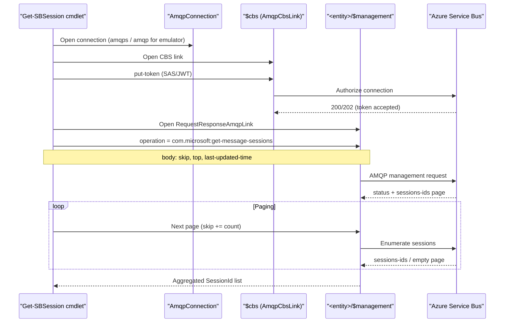

# `Get-SBSession`: как устроена реализация

Этот документ описывает реализацию cmdlet `Get-SBSession` в модуле `SBPowerShell`: зачем она нужна, как работает на низком уровне (AMQP management), какие есть режимы, ограничения и особенности Azure Service Bus vs Service Bus Emulator.

## Зачем понадобилась low-level реализация

В `Azure.Messaging.ServiceBus` (Track2 SDK) нет публичного API уровня:

- `GetMessageSessions()`
- `ListSessions()`

При этом legacy SDK (`WindowsAzure.ServiceBus` / Track1) умел перечислять сессии через `QueueClient.GetMessageSessions()` и `SubscriptionClient.GetMessageSessions()`.

Вывод: операция на стороне Service Bus существует, но в Track2 не экспонируется. Поэтому реализация `Get-SBSession` сделана через low-level AMQP management вызов.

## Что делает cmdlet

Cmdlet:

- принимает queue или topic/subscription
- открывает AMQP connection
- проходит CBS-авторизацию (`$cbs`)
- открывает management link на `<entity>/$management`
- вызывает AMQP operation `com.microsoft:get-message-sessions`
- читает список `sessions-ids` постранично
- возвращает `SBSessionInfo` (`SessionId`, `EntityPath`, `Queue/Topic/Subscription`)

## Основные файлы

- `src/SBPowerShell/Cmdlets/GetSBSessionCommand.cs` — PowerShell cmdlet и параметры
- `src/SBPowerShell/Amqp/ServiceBusSessionEnumerator.cs` — low-level AMQP/CBS/management реализация
- `src/SBPowerShell/Models/SBSessionInfo.cs` — модель результата

## Параметры cmdlet и семантика

### Сущность

Поддерживаются два parameter set:

- Queue:
  - `-Queue`
- Topic/subscription:
  - `-Topic`
  - `-Subscription`

### Режимы перечисления

- `default` (без `-ActiveOnly` и без `-LastUpdatedSince`)
  - отправляет `last-updated-time = DateTime.MaxValue` (UTC sentinel)
  - это low-level эквивалент parameterless `GetMessageSessions()` в legacy Track1 SDK

- `-ActiveOnly`
  - оставлен для legacy-совместимости
  - на wire уровне сейчас мапится на тот же `DateTime.MaxValue`, что и `default`
  - это сделано потому, что legacy SDK фактически делал то же самое (несмотря на XML docs)

- `-LastUpdatedSince <DateTime>`
  - отправляет заданный `last-updated-time`
  - возвращает сессии, чьё `session state` обновлялось после указанного времени

### Таймаут

- `-OperationTimeoutSec`
  - таймаут операции cmdlet (AMQP connection/CBS/management request)

## Wire-level протокол (что отправляется)

### AMQP management operation

Используется operation:

- `com.microsoft:get-message-sessions`

Это не публичный API Track2 SDK, но поддерживаемая Service Bus management операция.

### Request body (AMQP map)

Тело запроса — `AMQP map` (`AmqpMap`), а не обычный .NET `Dictionary`.

Поля:

- `skip`
- `top`
- `last-updated-time` (обязательно для текущей реализации; в т.ч. `DateTime.MaxValue` sentinel)

### Response body

Ожидаются поля:

- `skip`
- `sessions-ids`

Также читаются status fields из `application-properties`:

- `statusCode` / `statusDescription`
- fallback: `status-code` / `status-description`

## Почему нужен CBS

Перед вызовом management operation сервис требует авторизацию.

Последовательность:

1. Открываем AMQP connection
2. Открываем `AmqpCbsLink` (`$cbs`)
3. Делаем `put-token` (SAS token)
4. Открываем management link на `<entity>/$management`
5. Вызываем `com.microsoft:get-message-sessions`

Без этого обычно будет `401 Unauthorized`.

### Sequence diagram

## SAS/CBS: важные детали реализации

### 1) SAS подпись для Azure Service Bus

Для SAS (connection string с `SharedAccessKeyName/SharedAccessKey`) используется алгоритм, совместимый с `Azure.Messaging.ServiceBus`:

- HMACSHA256 от строки:
  - `<url-encoded-resource>\n<unix-expiry>`
- ключ — **raw UTF-8 bytes** строки `SharedAccessKey`
  - не `base64 decode`

### 2) Resource для CBS token

Для key-based auth токен делается на **namespace-level** resource (`namespaceAddress.AbsoluteUri`), что соответствует поведению SDK.

Иначе можно получить:

- `401 InvalidSignature`

### 3) Нормализация пути подписки

Для AMQP entity path используется canonical path c lowercase сегментом:

- `.../subscriptions/...`

Это важно для корректного `audience` / resource URI и проверки подписи на стороне Azure.

## Azure vs Emulator: различия

### Azure Service Bus (реальный)

Подтверждено:

- `default` режим работает
- `-LastUpdatedSince` работает
- `-ActiveOnly` после фикса также работает (legacy-совместимо, фактически тот же sentinel)

### Service Bus Emulator

Подтверждено:

- `-LastUpdatedSince` работает (например, после `Set-SBSessionState`)
- `default` / `-ActiveOnly` могут вести себя нестабильно или возвращать `500` (зависит от версии эмулятора)

Это ограничение/особенность эмулятора, а не обязательно клиента.

## Почему `-ActiveOnly` не гарантирует “только активные сообщения”

Исторически XML docs Track1 SDK описывали parameterless `GetMessageSessions()` как “only sessions with active messages”.

Но декомпиляция Track1 показывает, что parameterless вызов делает:

- `BeginGetMessageSessions(DateTime.MaxValue, ...)`

То есть отдельного wire-режима “active-only” там не было (по крайней мере в этом варианте реализации).

Поэтому в этом модуле:

- `-ActiveOnly` трактуется как **legacy-совместимый alias**
- а не как строгая гарантия “только сессии с активными сообщениями”

## Пагинация

Service Bus возвращает сессии страницами. Реализация:

- запрашивает `top = 100`
- стартует с `skip = 0`
- читает `sessions-ids`
- увеличивает `skip` по `response.skip + count`
- дедуплицирует `SessionId` в `HashSet`

Это повторяет поведение старого SDK достаточно близко для практического использования.

## Интеграционные проверки

### Локальный эмулятор

Есть xUnit интеграционный тест, который проверяет AMQP path на эмуляторе в режиме `-LastUpdatedSince` после `Set-SBSessionState`.

Сценарий:

- обновить session state для нескольких session id
- вызвать `Get-SBSession -LastUpdatedSince ...`
- убедиться, что session id присутствуют в выдаче

### Реальный Azure Service Bus

Ручной smoke-check выполнялся на реальном namespace:

- отправка сообщений в несколько сессий
- `Get-SBSession` (default)
- `Get-SBSession -LastUpdatedSince`
- `Get-SBSession -ActiveOnly`

## Практические рекомендации по использованию

- Для “покажи всё, что сервис отдаёт в legacy-совместимом режиме”:
  - используйте `Get-SBSession` (без флагов)
- Для сценариев, завязанных на `session state`:
  - используйте `-LastUpdatedSince`
- Для совместимости со старым скриптовым интерфейсом:
  - можно использовать `-ActiveOnly`, но не полагаться на строгую фильтрацию “только активные сообщения”

## Ограничения текущей реализации

- Нет отдельного “строгого active-only” режима (с гарантированной фильтрацией по active messages), потому что такой публично документированный wire-режим не подтверждён.
- Поведение `DateTime.MaxValue` sentinel может отличаться между Azure Service Bus и Emulator.
- Реализация опирается на приватную AMQP management operation (поддерживаемую сервисом, но не публично экспонированную Track2 SDK API).
